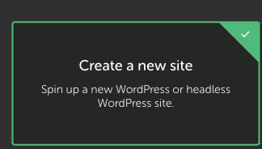

# RAG-EXA Plugin Setup

This repository contains the **RAG-EXA Plugin** for WordPress. Follow the steps below to set up a local WordPress environment and configure the plugin.

---

## Features
- AI-powered search with Exa + OpenAI integration.
- Autopage creation with custom template (`psybrarian`).
- Embedding for Q&A, files, and text into vector DB.
- Greenshift integration for frontend styling.

---

## Requirements
- **Local WP**

---

## Installation

3. Download or clone this repo into your `wp-content/plugins/` directory:

### 1. Local WordPress Environment
We use [LocalWP](https://localwp.com/) to run local instances of WordPress.

1. Install and activate Local WordPress.
2. Create a new site using LocalWP.

   - Name the site whatever you like (example: **Local Psybrary**)
   - Choose preferred settings
   - Create a simple username/password and use your primary email address
   - Turn on **OneClick Admin**
3. Go to your WordPress Admin Dashboard.


### 2. Request Access to Google Drive Assets
[Google Drive Assets](https://drive.google.com/drive/folders/1K-sBTSJfs7H6dkAohUhN5BWVwhpG04gz?usp=drive_link)


### 3. Required Plugins
1. Go to **Plugins → Add Plugin**
2. Search for **All-in-One WP Migration**
3. Install and activate the plugin: [All-in-One WP Migration](https://wordpress.org/plugins/all-in-one-wp-migration/)
4. Manually install the paid extension (Psybrarian Resources in Google Drive).
   - Download `all-in-one-wp-migration-unlimited-extension`
   - Go to **Plugins → Add New → Upload Plugin**
   - Upload the file, click **Install Now**, then **Activate Plugin**
   - Check for updates and click **Update Now** if available


### 4. Install the RAG-EXA Plugin
Download or clone this repo into your `wp-content/plugins/` directory:

```bash
cd app/public/wp-content/plugins/
git clone https://github.com/samnguyen92/rag-exa-plugin.git
```

### 5. Configure API Keys
From the plugins folder:

```bash
cd rag-exa-plugin
cp .env.example .env
```

Edit `.env` with your real keys:

```bash
EXA_API_KEY=your_real_exa_key
OPENAI_API_KEY=your_real_openai_key
```

Save the file.

### 6. Activate the Plugin
From your WordPress Dashboard:
**Plugins → Installed Plugins → Activate RAG-EXA Plugin**


### 7. Import the Preconfigured Site
1. Go to **All-in-One WP Migration → Import**
2. [Download .wpress Backup](https://drive.google.com/file/d/10rFN5wcDccXvQ4lAJjlygMMf-Cj2uFq7/view?usp=drive_link)
3. Upload the `.wpress` backup file.
4. Follow the prompts to restore the site.
   - This will replicate the beta setup.

### 8. Login Credentials
⚠️ **Note:** Your LocalWP credentials will be overwritten after the restore.
   - Use your beta credentials to log in
   - Or enable auto-login in LocalWP

### 9. Add the AI-Trainer Plugin
1. [Download AI-Trainer Plugin](https://drive.google.com/file/d/10rFN5wcDccXvQ4lAJjlygMMf-Cj2uFq7/view?usp=drive_link)
2. Go to **Plugins → Add New → Upload Plugin**
3. Upload the file, click **Install Now**, then **Replace Current** if prompted
4. Activate the plugin

### ✅ Test Installation
1. Go to **Pages**
2. Search for **Psybrarian**
3. View the page
4. Run a query
   - If you get both sources and a summary → ✅ Success!

---

## Usage

- The plugin automatically creates a training dashboard page when activated.
- Use the shortcode to embed the AI Search box anywhere:
  ```php
  [exa_search]
  ```
- You can manage **Q&A, Files, and Text** training data directly in the AI Trainer Dashboard plugin.
- For advanced styling, use the provided **Psybrarian Page Template**.

---

## 🔑 Environment Variables

- `EXA_API_KEY` → Your Exa.ai API key
- `OPENAI_API_KEY` → Your OpenAI API key

---

## 📜 License

MIT License © 2025
